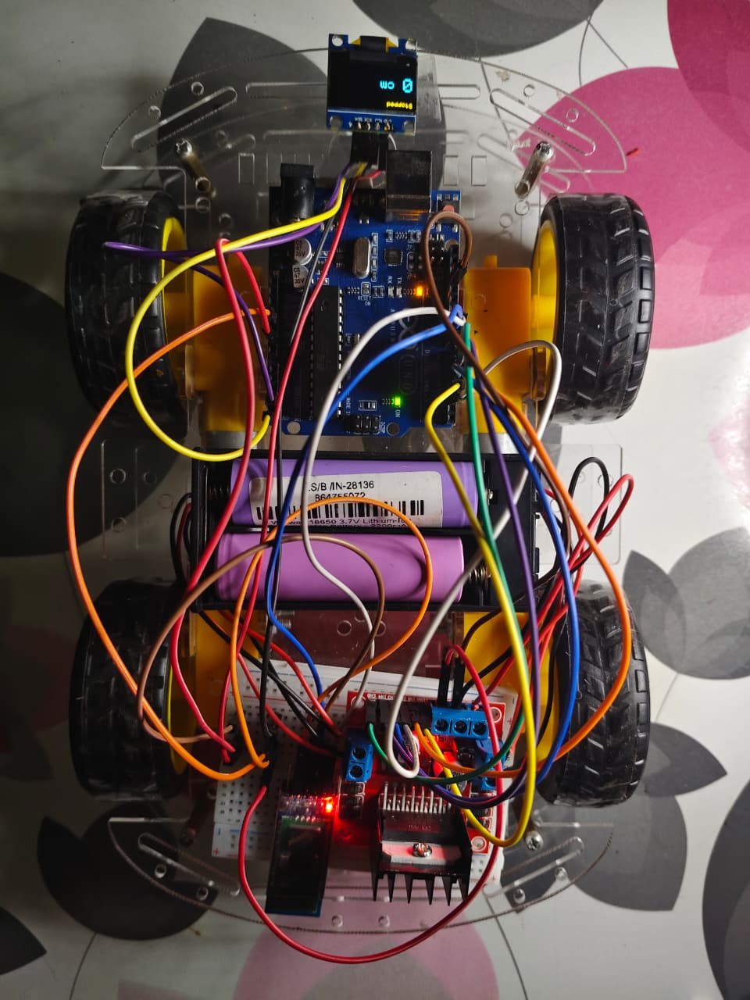
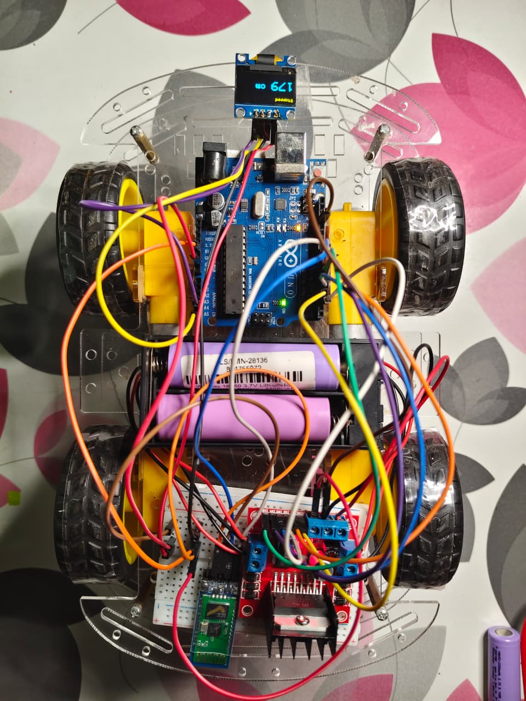

# Distance Measuring Bot 🚗📏

An Arduino-powered 4-wheel robot car that calculates real-time distance traveled using time-velocity kinematics with startup lag compensation. The system displays live metrics on an onboard 0.96" OLED display (SSD1306) and broadcasts live distance telemetry wirelessly via Bluetooth (HC-05/HC-06).

---

## 📸 Visual Showcase

### Hardware & Display Screenshots

| Initial State (0 cm Distance) | Distance Travelled State |
| :---: | :---: |
|  |  |

<br/>

### 🎥 Demonstration Video

Click the preview image or link below to watch the distance measuring bot running live:

<p align="left">
  <a href="assets/video.mp4">
    
  </a>
</p>

▶️ **[Watch `video.mp4` Demonstration](assets/video.mp4)**

---

## 🛠️ Hardware Components

- **Microcontroller**: Arduino UNO
- **Motor Driver**: L298N Dual H-Bridge Motor Driver
- **Chassis**: 4WD Robot Car Chassis with 4 DC Motors
- **Display**: 0.96" SSD1306 OLED (128x64 resolution, I2C interface)
- **Wireless Telemetry**: HC-05 / HC-06 Bluetooth Module
- **Power Source**: Battery pack for DC motors & logic circuit

---

## ⚡ Pin Connections

| Component | Pin Name | Arduino Pin |
| :--- | :--- | :--- |
| **HC-05 / HC-06 Bluetooth** | TX | Pin 8 (SoftwareSerial RX) |
| | RX | Pin 9 (SoftwareSerial TX) |
| **L298N Motor Driver** | ENA | Pin 3 (PWM) |
| | IN1 | Pin 7 |
| | IN2 | Pin 2 |
| | IN3 | Pin 4 |
| | IN4 | Pin 5 |
| | ENB | Pin 6 (PWM) |
| **SSD1306 OLED Display** | SDA | Pin A4 (SDA) |
| | SCL | Pin A5 (SCL) |
| | VCC | 5V / 3.3V |
| | GND | GND |

---

## 📐 Working Principle & Kinematic Model

Instead of raw wheel encoders, the robot computes distance accurately using calibrated time-velocity curve fitting that compensates for motor pickup lag ($\tau$).

### Kinematic Equation
For a run of duration $t$ seconds starting from rest:

$$d(t) = V_{\text{cm/s}} \cdot \left( t - \tau \cdot (1 - e^{-t / \tau}) \right)$$

Where at constant PWM speed set to **150**:
- **Steady Speed ($V_{\text{cm/s}}$)**: $71.2 \text{ cm/s}$
- **Pickup Lag Constant ($\tau$)**: $0.5 \text{ s}$

---

## 🎮 Bluetooth Serial Commands

Control the robot remotely using any Bluetooth serial application sent at 9600 baud rate:

| Command | Action | Description |
| :---: | :--- | :--- |
| `F` | Forward | Moves robot forward and accumulates positive distance |
| `B` | Backward | Moves robot backward and subtracts distance |
| `L` | Turn Left | Rotates robot left |
| `R` | Turn Right | Rotates robot right |
| `S` | Stop | Halts motors and commits current segment distance |
| `Y` | Reset | Halts motors and resets total distance back to `0 cm` |

---

## 📁 Repository Structure

```
├── assets/
│   ├── image-1.jpeg         # Initial state photo showing 0 cm distance
│   ├── image-2.jpeg         # Active state photo showing distance travelled
│   └── video.mp4            # Video demonstration of bot in motion
├── docs/
│   └── design_notes.md      # Technical design notes & theoretical math models
├── final-code/
│   └── final-code.ino       # Main production Arduino firmware
├── tests/
│   └── oled_test/
│       └── oled_test.ino   # Standalone OLED display animation test sketch
├── .gitignore               # Git ignore pattern rules
└── README.md                # Main repository documentation
```

---

## 🚀 Getting Started

1. **Hardware Wiring**: Wire the components as outlined in the [Pin Connections](#-pin-connections) table.
2. **Library Installation**: Install the required libraries in Arduino IDE:
   - `Adafruit GFX Library`
   - `Adafruit SSD1306`
3. **Upload Firmware**: Open [`final-code/final-code.ino`](final-code/final-code.ino) in Arduino IDE and upload it to the Arduino UNO.
4. **Operate**: Pair your mobile device/PC with the HC-05/HC-06 module, send directional commands (`F`, `B`, `L`, `R`, `S`, `Y`), and observe real-time distance measurements on the OLED screen!
